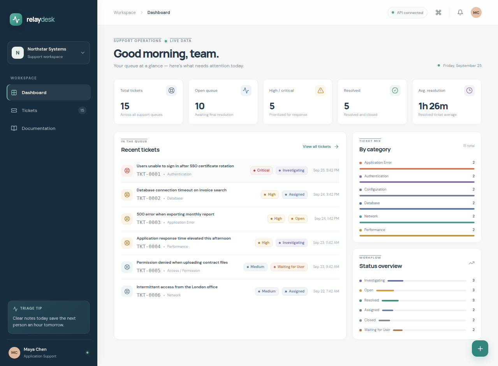

# Relay Desk — Support Ticket Triage

A compact, production-style **application-support ticket triage and tracking tool** built for a realistic resume project. Relay Desk demonstrates practical support workflows—from intake and categorization through investigation, resolution, and closure—using a React/TypeScript frontend, a FastAPI REST API, and SQLite.

> The application uses **no AI or LLMs**. Optional ticket categorization is deterministic keyword matching that returns its matched rule.

## Features

- Live dashboard cards for total, open, high/critical, resolved/closed, and average resolution time.
- Fifteen realistic, database-seeded support tickets on first launch.
- Create, search, filter, edit, assign, and inspect tickets; readable IDs are generated as `TKT-0001`, `TKT-0002`, and so on.
- Ticket categories, priorities, assignees, status lifecycle, linked runbooks, and investigation notes.
- Optional keyword-only automatic categorization with the ability to adjust the suggested category and priority.
- Resolution timestamps and calculated resolution durations; moving a ticket to **Resolved** or **Closed** records its resolution time.
- Five built-in troubleshooting guides, each with symptoms, likely causes, investigation steps, and a suggested resolution.
- Responsive layout with loading, error, empty, and toast-notification states.

## Tech stack

| Area | Technology |
| --- | --- |
| Frontend | React, TypeScript, Vite, Tailwind CSS, Lucide React |
| Backend | Python, FastAPI, Pydantic, SQLAlchemy |
| Database | SQLite |
| Communication | REST/JSON; the Vite development server proxies `/api` to FastAPI |

## Architecture

```text
support-triage/
├── backend/
│   ├── app/
│   │   ├── main.py                # FastAPI application, lifespan and router registration
│   │   ├── database.py            # SQLite engine, sessions and dependency
│   │   ├── models/ticket.py       # Ticket and documentation-guide ORM models
│   │   ├── schemas/ticket.py      # Pydantic request and response models
│   │   ├── routers/               # Ticket, dashboard and documentation REST routes
│   │   └── services/              # Seed data and keyword categorization
│   └── requirements.txt
├── frontend/
│   ├── index.html
│   └── src/
│       ├── components/            # Shared badges, dialogs and ticket detail panel
│       ├── pages/                 # Dashboard, ticket queue and guide library
│       ├── services/api.ts        # Typed fetch client with API error handling
│       └── types/                 # Shared frontend domain types
├── tests/test_api.py              # API lifecycle and documentation tests
├── vite.config.ts                 # Local `/api` proxy to FastAPI
└── README.md
```

## Database structure

- **`tickets`** — internal numeric primary key, unique readable ticket ID, title, description, category, priority, status, assignee, created/updated times, investigation notes, root cause, resolution, guide reference, and resolution timestamp.
- **`documentation_guides`** — guide ID/title/category, symptoms, possible causes, troubleshooting steps, and resolution.

The database is created automatically at `backend/app/support_tickets.db` the first time FastAPI starts. Fifteen tickets and five guides are inserted when the ticket table is empty. The database file is local and ignored by Git. To choose another SQLite location, set `DATABASE_URL` before starting FastAPI.

## REST API

| Method | Endpoint | Purpose |
| --- | --- | --- |
| `GET` | `/api/health` | Health check |
| `GET` | `/api/tickets` | List tickets; supports `q`, `status`, `priority`, `category`, and `assigned_to` filters |
| `POST` | `/api/tickets` | Create a ticket and generate its ticket ID |
| `GET` | `/api/tickets/{id}` | Read ticket details by internal database ID |
| `PUT` | `/api/tickets/{id}` | Edit ticket fields or append an investigation note |
| `PATCH` | `/api/tickets/{id}/status` | Change status and update resolution timing |
| `DELETE` | `/api/tickets/{id}` | Delete a ticket |
| `POST` | `/api/tickets/categorize` | Suggest a category using local keyword rules |
| `POST` | `/api/tickets/{id}/categorize` | Categorize and save the suggestion on an existing ticket |
| `GET` | `/api/dashboard/stats` | Database-backed KPI and distribution data |
| `GET` | `/api/documentation` | List troubleshooting guides |
| `GET` | `/api/documentation/{id}` | Read one troubleshooting guide |

Interactive API documentation is available at `http://localhost:8000/docs` while FastAPI is running.

## Local setup

Requirements: Python 3.10+, Node.js 20+, and npm/pnpm.

### 1. Install Python dependencies

```bash
cd support-triage
python3 -m venv .venv
source .venv/bin/activate
python -m pip install -r backend/requirements.txt
```

### 2. Start FastAPI

In a terminal with the virtual environment activated:

```bash
cd backend
uvicorn app.main:app --reload --port 8000
```

On startup, FastAPI creates/seeds the SQLite database if it is empty.

### 3. Install and start React/Vite

In a second terminal, from the project root:

```bash
cd support-triage
pnpm install
pnpm dev
```

Open `http://localhost:3000`. In development, `/api` is proxied to `http://127.0.0.1:8000`, so the default frontend configuration needs no environment file. To use another API origin, set `VITE_API_BASE_URL` to its `/api` base URL before starting Vite.

### Optional build and verification

```bash
pnpm check
pnpm build
DATABASE_URL=sqlite:///./tests/test_support_tickets.db PYTHONPATH=backend .venv/bin/python -m pytest tests -q
```

To reseed the sample data, stop FastAPI and remove `backend/app/support_tickets.db`, then start the backend again.

## Example workflow

1. Create a ticket such as **“Login failure after SSO certificate rotation.”**
2. Select **Auto-categorize** to get the `Authentication` suggestion from a matching keyword rule; adjust priority or category if needed.
3. Assign an engineer, link the authentication guide, and create the ticket.
4. Open the ticket, change its status to **Investigating**, and add a timestamped investigation note.
5. Edit root cause and resolution details; change status to **Resolved**. Relay Desk records the resolution timestamp and elapsed time.
6. Change status to **Closed** and use the ticket queue or dashboard to review the updated statistics.

## Screenshots



## Design notes

The interface uses a quiet, light neutral canvas, deep-navy workspace navigation, and restrained teal accents. It is designed for day-to-day internal support use rather than a high-density enterprise helpdesk suite.
